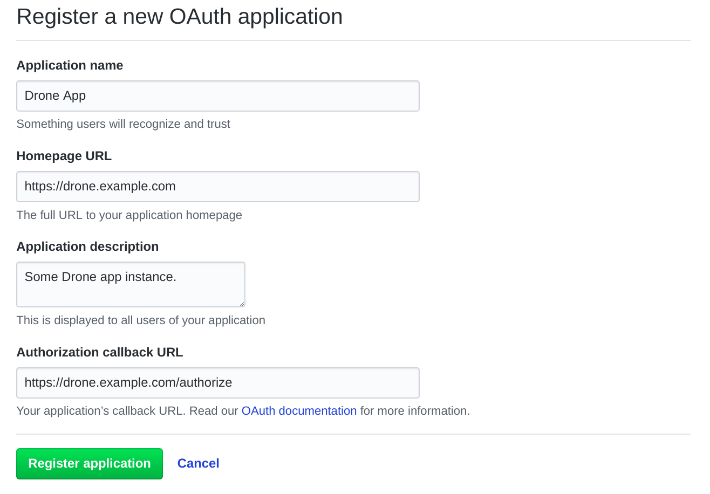
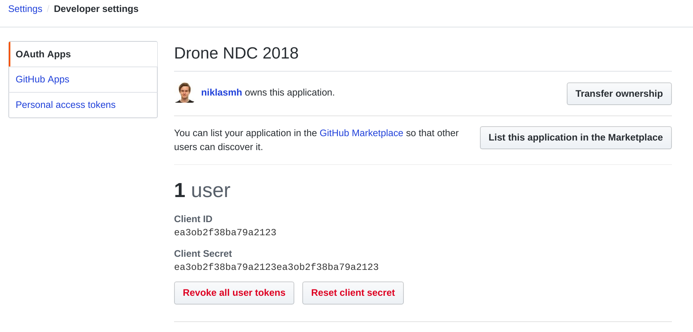

# Drone CI vs Jenkins: Demo

Demo to compare the set up in Drone CI and Jenkins.

## Set up

Create an OAuth App on `GitHub > Settings > Developer settings > New OAuth App`:



Now, get the OAuth credentials:



Set environment variables in `.env`:

```
JENKINS_PORT=xxxx
JENKINS_HOST=<schema>://<jenkinshost>
JENKINS_USER=root
JENKINS_TOKEN=sometoken
DRONE_PORT=yyyy
DRONE_ADMIN=some,admins
DRONE_HOST=<schema>://<dronehost>
DRONE_GITHUB_CLIENT=ea3ob2f38ba79a2123
DRONE_GITHUB_SECRET=ea3ob2f38ba79a2123ea3ob2f38ba79a2123
DRONE_SECRET=somesecretstring
```

You should also configure your servers such that triffic from `localhost:xxxx` goes to `<schema>://<jenkinshost>` and traffic from `localhost:yyyy` goes to `<schema>://<dronehost>`.

Now run:

```bash
docker-compose up -d
```

Go to your Drone CI host and register with your GitHub account. Select the GitHub project you want to listen to. When you have configured the `.drone.yml`-file, everything on the Drone CI part is done.

To configure Jenkins, go to your Jenkins host and use the password provided from the `docker-compose logs jenkins` to login. Configure your Jenkins and install the plugins you want. This can take a while. After configuration, make a `job` from the front page. Set a name to the job and make it a `Freestyle project`. Now set the job to use Git as Source Code Management and set Repository URL to an HTTPS-URL (To avoid SSH-keys. We only want to pull the repo for this demo). Add a build step in the Build section. Select `Execute shell` and write some commands like `$ echo Testing` to see if the build does something.
